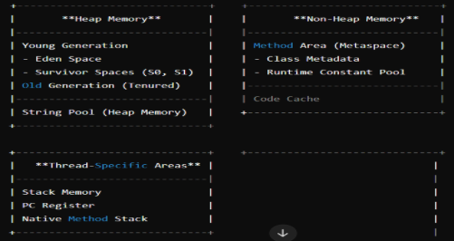
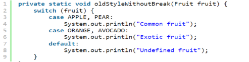
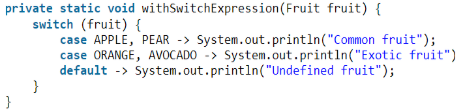
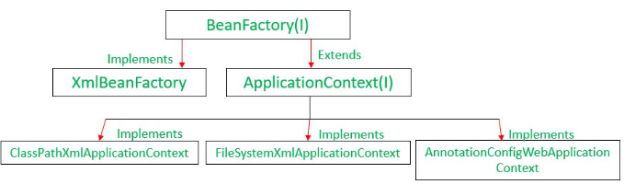
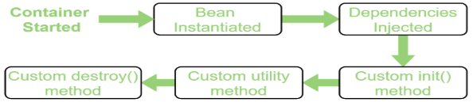
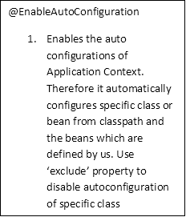
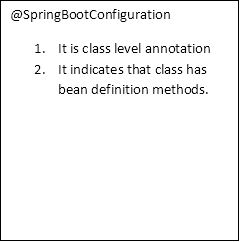
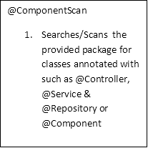

**Java Interview Questions**

1. **OOPS Concept**\
   OOPs Concept circulates around classes, Objects and 4 pillars of OOPs
- Classes:- User Defined Blue print from which Object are created.
- Objects:- They are instances of classes, They represent real life entities.
- Abstraction:- It is a process, which displays only the information needed and hides the unnecessary information. We use Abstract classes and Interfaces for abstraction. 
- Encapsulation:- It is defined as the wrapping up of data under a single unit. It bind together code and the data it manipulates.
- Inheritance:- It is a properties in which one object inherits properties another object.
- Polymorphism:- Polymorphism Means one name but many form. It is of 2 types:- 
- *Overloading* :- Happens when there exists many functions with same name but different parameters 
- *Overriding* :- Happens in case of inheritance.
1. **Interface**

   An interface is like a contract - it specifies what methods a class must have, but doesn't provide the implementation. Any class that 'signs' this contract by implementing the interface must provide concrete implementations for all the methods defined in the interface. (Contract means rules)

1. **Abstract Class**\
   An abstract class is a class that cannot be instantiated directly. It may contain both abstract methods (without implementation) and concrete methods (with implementation). It serves as a base for other classes to extend from.
1. **Abstract class vs Interface** 

   ||Abstract Class|Interface|
   | :- | :- | :- |
   |Type Of Method|Abstract & Non Abstract methods.|
Only abstract methods.

default and static methods(Java8)
|
   |Type Of Variable|Final, non final, static and non static variables.|Static and final variables|
   |Accessibility of data member|Private, public and default|Public by default.|
   |Multiple Inheritance|Does not supports|Supports|
   |Multiple Implementation|Can extend one or more interfaces only.|Can extend only one java class and one or more interface.|

1. **Can a class be loaded twice?**

   A class can't be loaded twice by same class loader. But a class can be loaded again with other class loader. Each class loader will contain each copy of class.

1. **What are different ways to create object in java?**
- Using the new Keyword (Most Common)
- Using Reflection API (Constructor.newInstance())
- Using Clone method.

*MyClass obj1 = new MyClass();*

*MyClass obj2 = (MyClass) obj1.clone();*

- Using Deserialization : When an object is deserialized from a byte stream, a new instance is created.
- Using Factory Methods : A Factory Method is a static method within a class (or a separate factory class) that is responsible for creating and returning instances of that class. The factory method uses one of the other methods (usually the new keyword) internally to create the object. The caller doesn't use new directly on the class.

*// Inside the class MyClass:*

*public static MyClass createInstance() {*

`    `*return new MyClass(); // Uses the 'new' keyword internally*

*}*

*// In your code:*

*MyClass obj = MyClass.createInstance(); // The caller uses a method, not 'new'*

1. **Class Loading Process in Java**

   The Class Loading Process has three phases:

- **Loading**: The ClassLoader loads the .class file (bytecode) into memory.Then It converts the binary data from the .class file into a Class object (of type java.lang.Class). Note: Every class is loaded by some ClassLoader.
- **Linking**: After loading, the JVM links the class into the runtime environment. This phase has three sub-steps:
- Verification: Ensures the bytecode is valid and doesn’t violate JVM security rules
- Preparation: Allocates memory to static variables and sets their default values (e.g., 0, null, false).
- Resolution: Converts symbolic references (e.g., variable and method names) into actual memory references.
- **Initialization**: This is the final phase. The static initializers and static blocks are executed. Static variables are assigned their explicit values.
1. **What are the scenarios in which we should use abstract class instead of interface?**
1. When we need to share Instance Variables:  In interface, Instance Variables are static and final (hence immutable) where as in abstract class these instance variables can be overriden in sub class.
1. When we need to define a Base Constructor: Abstract classes have constructors, allowing us to initialize fields or perform setup logic, which interfaces cannot do.
1. When we want to Restrict Inheritance:  Java allows a class to extend only one abstract class but can implement multiple interfaces. If we want to enforce a single inheritance chain, we can use an abstract class. Example: To prevent diamond problem
1. When we want Fine Grained Access Control: Abstract classes allow protected and private access modifiers for methods and fields, whereas interface methods and fields are implicitly public.

Real-Life Scenario: Vehicle Hierarchy in a Transportation System

Imagine we are developing a Transportation Management System where different types of vehicles (e.g. cars, bikes, and trucks) need to share common characteristics like a speed limit, engine details, or fuel consumption rate. Here's why abstract classes are preferred in this scenario:

1. ` `Common Fields:

All vehicles share common properties, such as speed, fuelCapacity, and engineType, which can be stored as fields in an abstract class.

For example:

Cars, bikes, and trucks all have speed limits.

All vehicles have fuel capacities and engine details.

1. Common Behavior:

Some functionality like starting an engine, stopping, or refueling can have a shared implementation across all vehicles but may also allow subclasses to override behavior.

1. Base Constructor:

Vehicles need initialization (e.g., speed, fuel capacity) when created. This requires a constructor, which can only be provided in an abstract class.

*// Abstract class for shared state and behavior*

*public abstract class Vehicle {*

`    `*protected int speed;            // Common property*

`    `*protected int fuelCapacity;     // Common property*

`    `*public Vehicle(int speed, int fuelCapacity) {*

`        `*this.speed = speed;*

`        `*this.fuelCapacity = fuelCapacity;*

`    `*}*

`    `*public void startEngine() {*

`        `*System.out.println("Engine started.");*

`    `*}*

`    `*public void stopEngine() {*

`        `*System.out.println("Engine stopped.");*

`    `*}*

`    `*public abstract void refuel();  // Force subclasses to implement this*

*}*

*// Subclass for Car*

*class Car extends Vehicle {*

`    `*private int numberOfDoors;*

`    `*public Car(int speed, int fuelCapacity, int numberOfDoors) {*

`        `*super(speed, fuelCapacity);*

`        `*this.numberOfDoors = numberOfDoors;*

`    `*}*

`    `*@Override*

`    `*public void refuel() {*

`        `*System.out.println("Refueling car with petrol/diesel.");*

`    `*}*

*}*

*// Subclass for Bike*

*class Bike extends Vehicle {*

`    `*private boolean hasCarrier;*

`    `*public Bike(int speed, int fuelCapacity, boolean hasCarrier) {*

`        `*super(speed, fuelCapacity);*

`        `*this.hasCarrier = hasCarrier;*

`    `*}*

`    `*@Override*

`    `*public void refuel() {*

`        `*System.out.println("Refueling bike with petrol.");*

`    `*}*

*}*

*// Subclass for Truck*

*class Truck extends Vehicle {*

`    `*private int loadCapacity;*

`    `*public Truck(int speed, int fuelCapacity, int loadCapacity) {*

`        `*super(speed, fuelCapacity);*

`        `*this.loadCapacity = loadCapacity;*

`    `*}*

`    `*@Override*

`    `*public void refuel() {*

`        `*System.out.println("Refueling truck with diesel.");*

`    `*}*

*}*
\*\
\
**When Multiple inheritance is required then use Interface.**

1. When we need Multiple Inheritance: exception Handling via runnable interface is preferred.
1. When we need to Achieve Loose Coupling.
1. When we need to Use Functional Programming (Java 8 and Beyond) : Interfaces with a single abstract method (functional interfaces) are ideal for lambda expressions and method references.

Example:

A Comparator interface is a functional interface used for sorting.

*public interface Comparator<T> {*

`    `*int compare(T o1, T o2);*

*}*

*// Lambda expression*

*Comparator<Integer> comparator = (a, b) -> a - b;*

1. **Why do we have constructor for Abstract class even if we can't instantiate it**
- If an abstract class serves as a parent class, its constructor can be invoked via super().
- When the child class is instantiated then it implicitly calls the base class’s default constructor via super(). 
- We can explicitly invoke the base class’s parameterized constructor using super(..arguments..). Invoking the constructor promotes initialization of variables and code reusability.
1. **Methods Possessed by Object class in java.**

   toString() - returns the String representation of the object.

   clone() - return exact replica of an object. 

   equals(), finalize(), etc.

1. **JDK, JRE,JVM**

   JDK is S/W development environment used to develop applications.

   JRE is implementation of JVM. It is set of S/W tools used to develop java applications.

   JVM 

1. **Access Specifiers.**
- Public : Variables, method and classes declared as public can be accessed by any class or method.
- Protected : Variables, method and classes declared as protected can be accessed with in that package and inherited class that lies outside the package.
- Private : Variables, method and classes declared as private can be accessed with in that class. 
- Default : Variables, method and classes declared as default can be accessed with in that package.
1. **Aggregation v/s Composition**
- *Aggregation* represents weak relationship. Also called Is-A relationship. We can Implement a aggregation using inheritance.
- *Composition* represents strong relationship. Also Called Has-A relationship. We can implement composition using "new" keyword. Hint : C S Has “new”keyword

For Example

Pulsar is a bike.

Bike has a engine.

1. Multi Threading. Why Multi Threading?

   Execute multiple threads independently at the same time.

   Why Multithreading? -> Efficient use of CPU. 

1. Thread & Process.
- *Thread*:- Light weight and smallest unit of process.
- *Process*:- Program in execution is called Process.
1. Ways of implementing Multi Threading.
- Extending Thread Class
- Implementing Runnable Interface.

Implementing Runnable interface is better way. In both ways, the **run**() method contains the code to be executed in new thread

*class MyThread extends Thread {\
` 	`@Override\
` 	`public void run() {\
` 		`for (int i = 0; i < 5; i++) {\
` 		   `System.out.println("Thread " + Thread.currentThread().getId() + ": Count " + i);\
` 		`}\
` 	`}\
}*

*public class ThreadExample {\
` 	`public static void main(String[] args) {\
` 		`MyThread thread1 = new MyThread();\
` 		`MyThread thread2 = new MyThread();*

*// Start the threads\
` 	`thread1.start();\
` 	`thread2.start();\
` 	`}\
}*

*class MyRunnable implements Runnable {\
` 	`@Override\
` 	`public void run() {\
` 		`for (int i = 0; i < 5; i++) {\
` 			`System.out.println("Thread " + Thread.currentThread().getId() + ": Count " + i);\
` 		`}\
` 	`}\
` `}*

*public class RunnableExample {\
` 	`public static void main(String[] args) {\
` 	`// Create instances of the MyRunnable class\
` 	`MyRunnable runnable1 = new MyRunnable();\
` 	`MyRunnable runnable2 = new MyRunnable();\
` 	`// Create threads and associate them with the runnables\
` 	`Thread thread1 = new Thread(runnable1); \
` 	`Thread thread2 = new Thread(runnable2);\
` 	`// these runnable1 & runnable2  can be changed into lamda expression. E.g.  given below \
` 	`// Start the threads\
` 	`thread1.start();\
` 	`thread2.start();\
` 	`}\
}*

*Thread thread1 = new Thread(()->{\
` 	`for (int i = 0; i < 5; i++) {\
` 		`System.out.println("Thread " + Thread.currentThread().getId() + ": Count " + i);\
` 	`}\
});*

1. User Thread & Daemon Thread
- *User Thread*:- User threads have a specific life cycle and its life is independent of any other thread. JVM waits for user threads to complete its tasks before terminating it. When user threads are finished, JVM terminates the whole program along with associated daemon threads.
- *Daemon Thread*:- daemon threads provides services and support to user threads. There are two methods available in thread class for daemon thread: setDaemon() and isDaemon().

We can create daemon threads in java using the thread class setDaemon(true). We should set a thread as Daemon Thread before thread exeution starts.

isDaemon() method is generally used to check whether the current thread is daemon or not.

1. Life Cycle Method of Thread.

   `	`a. New

   `	`b. Runnable

   `	`c. Blocked/Waiting

   `	`d. Timed Waiting.

   `	`e. Terminated State.

1. Different Methods used in Multi-threading.
- start() -> begin the execution of a newly created thread. Thread can call the start() method only once.
- run() -> begin the execution of the same thread. Thread can call the run() method multiple times.
- wait() -> tells the calling thread (a.k.a Current Thread) to wait until another thread invoke’s the notify() or notifyAll() method for this object. Here, Thread does loses its ownership of the resources and resume’s it’s execution only when resources are available after notify or notifyAll() is called.  Belongs to Object Class.
- sleep() -> used to pause the execution of current thread for a specified time in Milliseconds. Here, Thread does not lose its ownership of the resources and resume’s it’s execution. Belongs to Thread class.
- Notify() -> Wakes up only one thread that is in waiting state.
- NotifyAll() -> Wakes up all threads that are in waiting state.
- Join() -> Allows one thread to wait until another thread completes it execution, e.g. thread1.join() will ensure that thread1 is terminated before next instruction is processed by the program.
- Interrupt() -> t1.interrupt() interrupts the execution of t1 thread.
- Yield() -> Currently executing Thread is ready to temporarily pause itself and allow other threads to execute.
1. ***Synchronized Method***:- In this method, the thread acquires a lock on the method when it enters the synchronized method and releases the lock either normally when they leave the method or by throwing an exception. No other thread can use the whole method unless and until the current thread finishes its execution and release the lock. It can be used when one wants to lock on the entire functionality of a particular method. 
1. ***Synchronized Block***:-  In this method, the thread acquires a lock on the object between parentheses after the synchronized keyword, and releases the lock when they leave the block. No other thread can acquire a lock on the locked object unless and until the synchronized block exists. It can be used when one wants to keep other parts of the programs accessible to other threads.
1. Why are static block initialized before main method?

   To understand this, we need to look at the class loading process in the JVM.

   The JVM performs these steps:

   1\. Class Loading: The classloader loads class into memory.

   2\. Linking: The class is verified, prepared, and references are resolved.

   3\. Initialization: Static variables and static blocks are executed in the order they appear in the class.

   4\. main() Execution: After class initialization, the JVM looks for the main() method and executes it.

   So, static blocks are part of the class initialization phase, which happens before the JVM can call main().

1. What is static block and Why static block cannot throw checked exception?

   A static block is a block of code that runs only once, when the class is first loaded by the JVM.

   It cannot throw checked exceptions because static blocks run during class loading, not within a method context. Checked exceptions must be either handled or declared with throws, but since static blocks have no method signature, they can’t declare throws.

1. What is Race Condition?

   A race condition occurs when two or more threads can access shared data and they try to change it at the same time. 

   Because the thread scheduling algorithm can swap between threads at any time, we don’t know the order in which the threads will attempt to access the shared data. Therefore, the result of change in the data is dependent on thread scheduling algorithm, both threads are “racing” to access/change the data.

1. We can implement our own custom locking mechanism using Lock Interface (Reentrant Class)
1. Thread Pool : Collection of pre-initialized thread that are ready to perform any task.
1. What are the different ways we can implement multi-threading?
- Using @Async Annotation: 
- What @Async does? : When we mark a method with @Async, Spring Boot runs that method in a separate thread.
- How it works internally?

  ` `@Async uses a TaskExecutor to execute the task in another thread.

  TaskExecutor is Spring’s abstraction over Java’s Executor Framework 

- Default behaviour: By default, @Async uses SimpleAsyncTaskExecutor.
- Customizing the Thread Pool: We can define your own Task Executor using ThreadPoolTaskExecutor.
- When to use @Async : when we work with Fire-and-forget tasks. e.g. Sending mails, logging, showing notifications.
- Using CompleteableFuture.supplyAsync(()-> place your code here.) : It is a core java concept which is provided by *java.concurrent* package. By default it uses ForkJoinPool. We can use a custom Task Executor created using ‘*ThreadPoolTaskExecutor’.*
- Using Parallel Streams in case of arrays.
- Using Java’s Executor framework (It is native to java)

We can understand the multi-threading using this example. It uses @Async**\
In Interview, I was asked this question Suppose there are 10 Tasks (t1, t2, t3, t4, t5, t6, t7, t8, t9, t10). All Tasks represent DB calls to fetch data. Values from Task 1 are used in Task 6, Values from Task 2 are used in Task 7. That means Task 6 should run after Task 1 is completed and Task 7 should run after Task 2 is completed. Rest all tasks (db calls should run in parallel). Once all these 10 tasks are completed, I want the outcome of all the tasks (t3, t4, t5, t6, t7, t8, t9, t10) to be present in array. All these to be implemented via multi threading in spring boot application. All DB calls return a list and should be handled in multi threaded way.The DB calls should happen inside TaskDao.java and all these java files should be Autowired in TaskService.java like this @Autowired TaskDao taskDao; Provide appropriate code inside TaskDao.java, TaskService.java and AsyncConfig.java. For fetching data from db use hibernate.\
**AsyncConfig.java**

@Configuration\
@EnableAsync\
public class AsyncConfig {\
` 	`@Bean(name = "taskExecutor")\
` 	`public Executor taskExecutor() {\
` 		`ThreadPoolTaskExecutor executor = new ThreadPoolTaskExecutor();\
` 		`executor.setCorePoolSize(10);\
` 		`executor.setMaxPoolSize(20);\
` 		`executor.setQueueCapacity(100);\
` 		`executor.setThreadNamePrefix("AsyncTask-");\
` 		`executor.initialize();\
` 		`return executor; }}

**TaskDao.java**

@Repository\
public class TaskDao {\
` 	`@Autowired\
` 	`private TaskDataRepository taskDataRepository;    \
` 	`public List<String> fetchTask1() { // similary create for task2,task3,task4,task5,task8,task9,task10\
` 		`List<TaskData> taskData = taskDataRepository.findByTaskName("TASK\_1");\
` 		`return taskData.stream().map(TaskData::getDataValue).collect(Collectors.toList());}\
` 	`public List<String> fetchTask6(List<String> task1Data) { // similarly create for task7 which depends on task2data\
` 		`String filterValue = task1Data.isEmpty() ? "" : task1Data.get(0);\
` 		`List<TaskData> taskData = taskDataRepository.findByTaskNameWithFilter("TASK\_6", filterValue);\
` 		`return taskData.stream().map(TaskData::getDataValue).collect(Collectors.toList());}}

**TaskService.java**

@Service\
public class TaskService {    \
` 	`@Autowired\
` 	`private TaskDao taskDao;\
` 	`@Autowired\
` 	`private TaskExecutor taskExecutor;\
` 	`public CompletableFuture<List<List<String>>> executeAllTasksOptimized() {\
` 	`// Execute all tasks using supplyAsync with the thread pool\
` 	`CompletableFuture<List<String>> t1Future = CompletableFuture.supplyAsync(() -> taskDao.fetchTask1(), taskExecutor);\
` 	`CompletableFuture<List<String>> t2Future = CompletableFuture.supplyAsync(() -> taskDao.fetchTask2(), taskExecutor);\
` 	`CompletableFuture<List<String>> t3Future = CompletableFuture.supplyAsync(() -> taskDao.fetchTask3(), taskExecutor);\
` 	`CompletableFuture<List<String>> t4Future = CompletableFuture.supplyAsync(() -> taskDao.fetchTask4(), taskExecutor);   \
` 	`CompletableFuture<List<String>> t5Future = CompletableFuture.supplyAsync(() -> taskDao.fetchTask5(), taskExecutor);\
` 	`CompletableFuture<List<String>> t8Future = CompletableFuture.supplyAsync(() -> taskDao.fetchTask8(), taskExecutor);\
` 	`CompletableFuture<List<String>> t9Future = CompletableFuture.supplyAsync(() -> taskDao.fetchTask9(), taskExecutor);\
` 	`CompletableFuture<List<String>> t10Future = CompletableFuture.supplyAsync(() -> taskDao.fetchTask10(), taskExecutor);

`        `// Handle dependencies\
` 	`CompletableFuture<List<String>> t6Future = task1Future.thenComposeAsync(\
` 		`task1Result -> CompletableFuture.supplyAsync(() -> taskDao.fetchTask6(task1Result), taskExecutor),\
` 		`taskExecutor);\
` 	 `CompletableFuture<List<String>> t7Future = task2Future.thenComposeAsync(\
` 		`task2Result -> CompletableFuture.supplyAsync(() -> taskDao.fetchTask7(task2Result), taskExecutor),\
` 		`taskExecutor);\
return CompletableFuture.allOf( t3Future, t4Future, t5Future, t6Future,  t7Future, t8Future, t9Future, t10Future)\
.thenApply(v -> Arrays.asList(t3Future.join(), t4Future.join(), t5Future.join(),t6Future.join(), t7Future.join(), t8Future.join(),t9Future.join(), t10Future.join()));}

1. What is the use of TaskExecutor?

   The taskExecutor defines the thread pool that will execute the asynchronous tasks.

   All TaskExecutors internally uses Executor Framework.

   There are different types of Task Executors. Some of the prominent task executors are: ThreadPoolTaskExecutor, SimpleAsyncTaskExecutor,  SyncTaskExecutor (Unit testing for sequential task execution.) TaskExecutor is a *wrapper* around the **thread pool** implementation.

   When we use *CompletableFuture.supplyAsync(..., taskExecutor)* or annotate methods with *@Async("taskExecutor")*, Spring delegates the work to that executor.

1. ` `What is ForkJoinPool?

   It is a special thread pool that is by default used by CompleteableFuture.supplyAsync(). \
   It’s designed for tasks that can be split into smaller subtasks and then merged later (“fork” and “join”).

   when we use: *CompletableFuture.supplyAsync(() -> someTask());* by default, it runs on the common ForkJoinPool.

1. Executors Framework: It is a multi-threading  framework which is involved in creating and managing threads. Internally it uses ThreadPoolExecutor.

   Executor Framework has 3 core interfaces	

- Executor
- ExecutorService : It internally extends executor class.
- ScheduledExecutorService : It internally extends ExecutorService.

Step1 à Create a pool of thread of type ExecutorService. \
ExecutorService executor = Executors.newFixedThreadPool(number of threads).\
Step2 àexecutor.submit(()à{multithreading logic that we want to implement})\
this submit method returns a “future”. The future.get() method can hold the execution of thread and wait until the “future” gets resolved.\
Step 3 à executor.awaitTermination(timeout time, TimeUnit);\
This will hold and wait until all the threads complete their execution.\
Step 4 à executor.shutdown();

1. How many Thread Pools are present in Java+spring boot application

   In modern Spring Boot applications, we have several types of thread pools catering to different needs:

- **ForkJoinPool**: A special thread pool designed for divide-and-conquer tasks — where big tasks are broken into smaller ones that can run in parallel. It is used by CompletableFuture.supplyAsync() and parallelStream() by default.
- **FixedThreadPool**: It is a type of pool that always keeps the same number of threads running. If all threads are busy, new tasks wait in a queue until one is free. example: Executors.newFixedThreadPool(10)
- **ScheduledThreadPool**: It is a type of thread pool that runs tasks after a delay or periodically. Used for recurring jobs, cleanup tasks, etc.
- **Web Server Pool** : A pool of threads managed by the web server (like Tomcat). Each incoming HTTP request is handled by a thread from this pool. Once the request is processed, the thread is returned to the pool.	
- **Connection Pool** : A pool of database connections reused by multiple requests. By default, Spring Boot uses HikariCP.
- **Virtual Threads** : Newly introduced light weight threads that are managed by JVM. Java provides Executors.newVirtualThreadPerTaskExecutor() — an executor that creates a new virtual thread per task.
1. What are virtual Threads and how are they game changer in context of multi threading?

   Virtual Threads are light weight threads managed by JVM. They were introduced in Java21. They differ from normal threads which are managed by OS.\
   Traditionally, Java threads are directly mapped one-to-one with operating system (native) threads. These OS threads were heavy and consumes a lot of memory (around 1MB). Also context switching was also expensive. This limited how many concurrent threads we could run. 

   With virtual threads, we can create hundreds of thousands or even millions of concurrent threads because they are lightweight, cheap to create, and managed entirely within the JVM.

   Hence we can say that virtual threads are abstraction of OS threads.

1. What are futures and Completable Futures and how they differ from each other?

   Future was introduced in Java5 as a part of concurrency framework, which represent the result of an asynchronous operation. Future has following limitations:

- Blocking — future.get() blocks the thread until the result is ready.
- No chaining of async tasks — can’t combine or compose multiple asynchronous tasks.

Completeable Future was introduced in Java8 as an enhancement to Future. Completeable Future supports Non-Blocking and chaining of async operations. 

1. What happens when all the threads of thread pool are busy?

   If all threads are busy, new tasks wait in the queue for the threads to get free.

1. Runnable v/s Callable Interface\
   The Runnable and Callable interfaces both used to represent tasks that can be executed by a thread.\
   The Runnable interface is used when a task needs to be executed but does not return a result.\
   The Callable interface is used when a task needs to return a result or throw a checked exception.

||Runnable|Callable|
| :-: | :-: | :-: |
|Return Value|Does not return a result (void).|Returns a result of generic type T.|
|Method|void run()|T call()|
|Exception Handling|Cannot throw checked exceptions.|Can throw checked exceptions.|
|Introduced In|Java 1.0|Java 5 (with the java.util.concurrent package).|
|Usage with Threads|Can be executed directly by a Thread or an Executor.|Can only be used with an ExecutorService.|
|Result Handling|No result; used for side effects like printing.|Result can be retrieved using a Future.|

1. Exceptions v/s Error.
- Exception: - Abnormal condition that disrupts the normal flow of the program.
- Error: - Error is caused by the environment in which the JVM is running, exceptions are caused by the program itself.
1. Checked & Unchecked Exception
- *Checked Exception*: - Also called as Compile time Exeption. e.g. ClassNotFoundException, SQLException, IOException, etc
- *Unchecked Exception*: - Also called as Run time exception. e.g. NumberFormatException, NullPointerException, ClassCastException, ArrayIndexOutOfBoundException, StackOverflowError etc.
1. How to create a custom exception and how to throw it?

   **Creating a Custom Exception**:

   To create a custom exception, you need to define a new class that extends either Exception or one of its subclasses (e.g., RuntimeException). You can add your own fields and methods to the custom exception class as needed. Here's an example:

*public class CustomException extends Exception {\
` 	`public CustomException(String message) { super(message); }\
}*

In this example, we've created a custom exception named CustomException that extends the base Exception class. It accepts a message as a constructor parameter, which is passed to the superclass constructor using super(message).

**Throwing a Custom Exception**:

To throw your custom exception, we can use the throw statement within our code. For example:

*public class CustomExceptionExample {*

`    `*public static void main(String[] args) {*

`        `*try {*

`            `*// Simulate a condition where the custom exception is thrown*

`            `*throw new CustomException("This is a custom exception.");*

`        `*} catch (CustomException e) {*

`            `*System.err.println("Custom Exception Caught: " + e.getMessage());*

`        `*}*

`    `*}*

*}*

In this example, we use the throw statement to throw an instance of our custom exception (CustomException) within a try block. If the condition is met, the custom exception is thrown. We then catch and handle the custom exception in the catch block, where we can access the exception's message using e.getMessage().

1. What is volatile keyword?

   When a variable is declared as volatile, it indicates the JVM and the compiler that the variable's value may be changed by multiple threads simultaneously. It ensures that the variable is always read from and written to main memory (rather than being cached in a thread's local memory).

1. Differentiate between throw, throws and throwable.
- *Throw* : ‘throw’ is used to throw an exception manually in Java. Using this keyword, it is possible to throw an exception from any method or block.
- *Throws* : ‘throws’ is used in the method signature in Java. If the method is capable of throwing exceptions, it is indicated by this method.
- *Throwable* : It is super class for all types of errors and exceptions in Java. In case customized exceptions are created, they should extend this class too.
1. What will happen if a code snippet has try, catch and finally block and try block, catch block and finally block have their different return statements that return different values. What will we get when we execute the code snippet?

   When a method has try, catch, and finally blocks each containing different return statements, the “finally block's return statement will override any previous return values”.

1. What is try-with resources?

   Until  Java1.6  it is highly recommended to write finally  block to close resource which are open as part of try block.

   The problems in this approach are:- 

- The programmer is required to close the resources inside finally block. It increases the complexity of programming.
- We have to write finally block compulsory and hence it increase the length of code.

To overcome above problem Java introduced try with resources in java 1.7 version.

The main advantage of try with resources is whatever resource we open as part of try block will be closed automatically once control reaches end of try block either normally or abnormally and hence we are not required to close explicitly so that complexity of program can be reduced. We are not required to write finally block so that length of code will be reduced.

1. What is try with multiple resources?

   We can declare multiple resources but these resources should be separated with semicolon.\
   eg. Try(resource1; resource2; resource3) { }

   Some of the resources used with try with resources are: FileInputStream, FileOutputStream, BufferedReaders, BufferedWriters, Database connections etc.

Note: What kind of resource we can use in try with catch and try with multiple resources.

- All resource should be AutoCloseable.
- A resource should be autoclosable  if and only if corresponding class implement java.lang.AutoCloseable interface. Example: All IO related resources, Database resources and network related resources.
- AutoClosable interface came in Java 1.7 and it contains only 1 method public void close()
1. Iterator vs listIterator.

   |Iterator|List Iterator|
   | :- | :- |
   |Traverse elements only in the forward direction|Traverse elements both in forward and backward directions|
   |Traverse Map, List and Set|Traverse List and not the other two.|
   |Indexes cannot be obtained|It has methods like nextIndex() and previousIndex() to obtain indexes|
   |Cannot modify or replace elements.|Can modify or replace elements with the help of set(E e)|
   |Cannot add elements and it throws ConcurrentModificationException.|Can easily add elements to a collection at any time|
   |
Iterator itr = collection.iterator();

while(itr.hasNext()) { // add your code here.}

|
ListIterator ltr = list.listIterator();

while (ltr.hasNext()) {// add your code here.}

|
String V/S  String Buffer

|String|String Buffer|
| :- | :- |
|String is immutable|StringBuffer is mutable|
|String is slow and consumes more memory when we concatenate too many strings because every time it creates new instance.|StringBuffer is fast and consumes less memory when we concatenate strings.|
|String uses String constant pool.|StringBuffer uses Heap memory|
|
To concat 2 Strings we use .concat method.

|To concat 2 StringBuffers we need .append method.|

String Buffer v/s String Builder

|String Buffer|String Builder|
| :- | :- |
|StringBuffer is synchronized i.e. thread safe|StringBuilder is non-synchronized i.e. not thread safe.|
|Less Efficient|More Efficient|
|Introduced in java1.0|Introduced in java 1.5|

1. Is there any difference in defining or creating a String by using String Literal and by using new Operator().
   - String Literals are stored in String Pool. String Pool is a special area inside the heap memory dedicated to storing string literals. It ensures that identical string literals are stored only once, making memory usage more efficient. 
   - String created using new Operator are stored in Heap. The heap memory is the general-purpose memory area where all objects (including strings created with the new keyword) are stored.
1. Memory Model Of Java

   Traditional (before Java 8)

- Class (Method) Area
- Heap
- Stack
- PC Register
- Native method Stack

Modern Memory Model (After Java 8)

- **Non Heap Memory**: It is designated for storing the metadata and is necessary for the JVM to operate.
1. Meta Space (previously called class(method) area): It stores Meta Data related to Classes.
1. Code Cache: This area is used by the Just-In-Time (JIT) compiler to store code generated by compiling frequently executed Java methods.
- **Heap Memory**: It stores all objects and their instance variables. Heap is also shared across all threads. 
1. Young Generation: GIVEN BELOW.
   - Eden Space 
   - Survivor Space (S0, S1)
1. Old Generation
1. String Pool
   - **Thread Specific Memory**
1. Stack: Each thread has its own private Stack which contains frames. Each frame represents a method call. (Trick: Here each Frame is analogous to Local Execution context in JavaScript)
1. PC Register: It holds the address of the next instruction to be executed within the frame.
1. Native Memory Stack: It is used in the execution of the** methods written in languages other than Java (typically C or C++) and executed by the operating system, not the JVM itself.

**Young Generation**: It is a section of the Heap Memory where memory is allocated to most newly created objects. Internal working is as follows:

- When we create new objects (use new keyword), it is stored in Eden space.
- When Eden fills up, a minor Garbage Collection occurs. Unreachable (dead) objects are removed from Eden. Live objects are moved to either of the Survivor spaces (either S1 or S0) and their age is incremented. 
- When next Minor GC happens Eden and the previously occupied Survivor Space (Let, S0) is checked. Live objects from both areas are copied to the other Survivor Space (S1). Their age counter is incremented again. S0 and Eden are then cleared.
- The Survivor Spaces (S0 and S1) are continually swapped, ensuring that one is always empty.
- If an object survives enough swapping cycles (reaches the swapping threshold), it is copied to the Old Generation instead of the other Survivor Space.
- The Objects can lives in Old Generation until it is not referenced in the application and can be removed in next major GC.  There is no fixed time limit for how long an object can survive in the Old Generation.
- Major Garbage Collection (GC) is triggered when the Old Generation reaches a certain threshold of occupancy.

**String Pool**: It is also called String Constant Pool. It is the memory area in the heap, that only handles String which are created using String Literal (e.g., String s = "hello";). When we create a string using String literal JVM First checks in the String Pool to see if any string with the value "hello" already exists. If it exists, the JVM returns a reference to that existing, pooled object. If it does not exist, a new String object is created in the pool, and its reference is returned. Note that when we create String using new String(“hello”), it is not stored in String pool, rather it is stored in other area of Heap Memory.

1. Garbage Collection 

   Process of reclaiming runtime unused memory automatically is called Garbage Collection. It is automatically done by JVM.

1. **Difference Between Comparable and Comparator Interface.**

   ||Comparable|Comparator|
   | :- | :- | :- |
   |Method used|compareTo() |compare()|
   |Package|Java.lang|Java.util|
   |Sorting order|Sort data according to natural sorting i.e. in one order only. E.g. alphabetical for String, ascending for numbers|Sort data according to customized sorting order(sorting based on multiple criteria at same time; for example sorting based on name, age and salary at same time)|
   |Logic of sorting|Logic of sorting must be in same class|Logic of sorting should be in different class|

1. **What is difference between Method Overloading and Method Overriding?**

   ||Method Overloading|Method Overriding|
   | :- | :- | :- |
   |When it happens?|Compile time. Hence called compile time polymorphism |Runtime. Hence called runtime polymorphism.|
   |Where it happens?|In same class or within sub class.|Only in sub class.|

1. Can we Overload Main method?\
   Yes. But JVM will always call the main method with below signature.\
   public static void main(String [] args)
1. What is public static void main(String [] args)?
- public : This access specifier indicates that main method can be called from anywhere.
- static: No object is required to call the main method.
- void : Main method does not return any value.
- String[] args : arguments passed while running the program.
1. Can we change the order of public, static and void keywords?

   Yes, but void should come just before method name.  static public void and public static void are acceptable.

1. Can we start a thread twice?\
   No. We cannot do that. It may give illlegalThreadStateException 
1. **What is Serialization in java?**\
   Serialization is the process of converting a java object into a ByteStream while deserialization is the other way around.
1. **What is serial version UID** 

   SerialVersionUID is used to provide versioning information for serialized objects. 

   Key characteristic of serialVersionUID is that its value does not change during the process of serialization or deserialization.

   JVM by default assigns a field called serialVersionUid to all the classes that extends Serializable class. We can explicitly assign this field as well.

   The serialVersionUID ensures that the deserialized object is compatible with the class when object was serialized. If there is mismatch then InvalidClassException is thrown.

1. **How can we Serialize a Java Object and how to deserialize it?**

   **Serialization**

   Assuming that we have Student Object that we want to serialize. \
   Note: Student class should implement Deserializeable interface and the method below will throw IOException.

   *FileOutputStream  fos = new FileOutputStream(“filename.txt”);*

   // FileOutputStream is an outputstream for writing data/streams of raw bytes to file 

   *ObjectOutputStream oos = new ObjectOutputStream(fos);*

   // ObjectOutputStream writes primitive data types Java objects to an OutputStream.

   *oos.writeObject(Student);*

   // writes the specified object to the ObjectOutputStream

   oos.close(); fos.close();

   **Deserialization**

   FileInputStream fis = new FileInputStream(“filename.txt”); 

   //reading the data from file.

   ObjectInputStream  ois = new ObjectInputStream(fis);

   // ObjectInputStream is used to recover those objects previously serialized

   Student student = (Student) ois.readObject();

   Ois.close();

1. **Suppose we have 5 variables in Object and out of which we want to convert only 3 variables into Byte Stream. How can we achieve this?**\
   We can mark a variable as Transient. Via this we ensure that transient variables are not serialized to Byte Class. For example: Passwords can be marked as Transient. 

   public class Student implements Serializable {

   `	`private String name;

   `	`private String email;

   `	`transient private String password; // along with getter, setter and constructor

   }

   Transient fields are not serialized in java during object serialization.

1. **If you mark a field as transient in a serialization class, what happens when the object is deserialized and how do you handle restoring that field?**

   When a field is marked as transient, it is not serialized — meaning its value is not saved to the byte stream.

   During deserialization, the field is restored to its default value (e.g., null for objects, 0 for numbers, false for booleans).

   To restore its value, we can either recompute it or manually set it inside a custom readObject() method.

   For Example: We often mark sensitive information like passwords or connection objects as transient to prevent them from being persisted or exposed during serialization. We might re-fetch the value from a secure store or re-compute it from other serialized data.

1. **How to create Immutable class in java?** For more detailed answer refer GFG.

   An immutable class is a class whose instances, once created, cannot be modified.\
   a. Make class final.\
   b. Make all variables private & final. 

   c. Provide only getters and no setters are required.

   d. Set the value of variable only via parameterized constructor.

1. **What is fail-fast and fail-safe in java?**\
   While iterating through the collection and if another thread tries to modify the list on which we are iterating, in that case there is concurrent modification exception and it is called **fail-fast**.\
   Fail-Fast happens on Arraylist, Linkedlist\
   While iterating over a collection we are given a copy of collection, so we don’t iterate on original collection. By this concurrentModificationException is not thrown. This is called **fail-safe**. Fail Safe happens on concurrent hashmap.
1. **What is copy-on-write arraylist and how it differs from arraylists?**

   Copy-on-write arraylist is a thread safe variant of arraylist in which all the mutative operations(add, remove) are performed on new copy of underlying operations. It is used to perform fail-safe operations and is particularly useful in read-heavy scenarios with infrequent modifications. 

1. **findFirst() v/s findAny()** 

   **findFirst()** method finds the **first element** in a Stream. So, we use this method when we specifically want the first element from a sequence. It returns an optional.

   **findAny()** method allows us to **find any element** from a Stream. We use it when we're looking for an element without paying an attention to the encounter order. It also returns an Optional.

1. **Difference between HashMap and concurrent HashMap?**

   HashMap is not thread safe where as Concurrent  HashMap is thread safe.

1. **What is ConcurrentModificationException?**\
   It occurs when we try to modify a collection concurrently. \
   For example: While iterating any collection if we try to modify the structure or add or remove elements then it may result in ConcurrentModificationException.
1. In continuation to above question, In concurrentHashMap we will get concurrentModificationException . what if I use HashTable which is also thread safe. Will we get concurrentModificationException?\
   If multiple threads try to accept the hashtable, the thread will acquire a lock on entire table, but in case of concurrentHashMap, if there are 16 segments, thread will be acquired on only one segment and rest of segments are available for changes.
1. Why wait() and notify() method belongs to object and not to thread class?\
   Because locking mechanism belongs to Object class and not Thread class.
1. What does Arrays.stream do in java?

   It converts Arrays into sequential Stream

1. **What is Marker Interface?**\
   An empty interface is called Marker Interface. SerialIzable And Clonable are example of Marker Interface. Concept off Marker Interface is Obsolute. Instead annotations are used

   Ex: public interface MarkerInterface{}

1. **What is Thread Safety**?\
   When multiple threads are working on the same data structure, and the value of data structure is changing, that scenario is not thread-safe and we will get inconsistent results. When a thread is already working on an object and preventing another thread on working on the same object, this process is called Thread-Safety.
1. What are Interceptors in Spring Framework?\
   Interceptors are components that allow us to intercept *and manipulate the request/response*  in an application. Interceptors add cross-cutting concerns to our application, such as logging, security checks, authorization, etc.
1. HashTable v/s Concurrent HashMap?

   Similarities between HashTable and concurrent hash map

1. **Key-Value Storage**: Both store data in the form of key-value pairs. 
1. **Hashing**: Both use hashing to determine the bucket location for storing and retrieving entries.
1. **Fast Lookup**: Both structures provide fast lookup times for retrieving values associated with keys. 
1. **Thread-Safe Operations**: Both are thread-safe but they differ in their level of thread safety, hence can be used in multi-threaded environments. 
1. **Performance (Average Case):** Both provide O(1) average time complexity for get() and put() operations.

Differences between HashTable and ConcurrentHashMap:

1. **Synchronization Mechanism:** Hashtable locks the entire map for every operation. ConcurrentHashMap uses Granular locking which allows  concurrent reads and updates without blocking the whole map.
1. **Concurrency Level:** Hashtable allows only one thread to access it at a time. ConcurrentHashMap allows multiple threads to read and write.
1. **Performance**: ConcurrentHashMap perform better in high-concurrency scenarios due to fine-grained locking. HashTable's global synchronization can lead to performance issues.
1. **Legacy v/s Modern API**: Hashtable is a legacy class. ConcurrentHashMap is the modern, hence preferred.
1. I have an interface in java.\
   In that, I have provided 10 methods.\
   Do I need to implement all 10 methods if any class implements that interface?

   If we have an interface with 10 methods, any class that implements this interface must provide concrete implementations for all 10 of those methods. Failure to do so will result in a compilation error.

1. I have an abstract class in java.

   In that class I have 5 abstract methods and 5 non abstract methods.

   Do I need to provide implementation of all abstract and non abstract methods in class that extends abstract class?

   In Java, when you have an abstract class that contains a combination of abstract methods and non-abstract methods, the rules for providing implementations in classes that extend the abstract class are as follows:

   Abstract Methods: Any class that extends the abstract class must provide concrete (non-abstract) implementations for all the abstract methods declared in the abstract class. Failure to do so will result in a compilation error.

   Non-Abstract (Concrete) Methods: Classes that extend the abstract class are not required to override or re-implement non-abstract (concrete) methods from the abstract class. However, they can choose to override them if they want to customize the behavior defined in the abstract class. If they don't override these methods, they will inherit the implementations provided by the abstract class.

1. Java New Features from Java 8 to Java 17.

   Java8 v/s Java11 new Features

- Several new methods of String such as isBlank(), lines(), repeat(n), and many more were introduced.
- pattern recognition is possible in java11, with the help of the asMatchPredicate() method.
- var keyword was introduced in Java 11.

Java 11 v/s Java17 

- Text Blocks

we can place our text in between the triple quotes and have multiple double quoted strings inside it without having to use escape characters.

String text = """

`            `{

`              `"name": "John Doe",

`              `"age": 45,

`              `"address": "Doe Street, 23, Java Town"

`            `}

`          `""";

- Improvised Switch Statement

  

  Absence of break will print all the cases. To avoid this switch expressions are introduced, which do not requires break statement.

  

- Introduction of record classes : record classes are a special kind of immutable class which is meant to replace data transfer objects(DTOs).
- Introduction of Sealed classes: sealed class will give us more control over which classes are allowed to extend our classes.

Java17 v/s Java21

- Introduced Virtual Threads
- Introduction of Pattern matching for Switch
1. What is SOAP & REST. How it is different from REST?

   SOAP stand for Simple Object Access Protocol. It is a messaging protocol for exchanging structured information in the implementation of web services.

   ||SOAP|REST|
   | :- | :- | :- |
   ||It is a Protocol|It is Architectural Style|
   |Data Format |XML|XML, HTML, JSON|
   |Security|SSL & WS-Security|SSL & HTTPS|
   |BandWidth|Consumes High Bandwidth|Consumes Less Bandwidth|
   |Caching|Can not be cached|Can be Cached|
   |Payload handling|Has strict communication contract and need knowledge of everything before any interaction|Need no knowledge of API|
   |ACID Compliance|Has built in ACID compliance to reduce anomalies|Lacks ACID Compliance|

1. What are atomic variables in java?

   Atomic variables allow us to perform thread-safe operations** on single variables** without using synchronization or manual locking**.**

1. How to create enum in java? 

   Example1

   enum Day {

   `    `SUNDAY, MONDAY, TUESDAY, WEDNESDAY, THURSDAY, FRIDAY, SATURDAY;

   } 

   Example 2

   enum Day { SUNDAY("Sun"), MONDAY("Mon"), TUESDAY("Tue"), WEDNESDAY("Wed"),

   `     	       `THURSDAY("Thu"), FRIDAY("Fri"), SATURDAY("Sat");

   `    `private final String abbreviation;

   `    `// Constructor for enum constants

   `    `private Day(String abbreviation) { this.abbreviation = abbreviation; }

   `    `public String getAbbreviation() { return abbreviation; }

   } 

   public class EnumConstructorExample {

   `    `public static void main(String[] args) {

   `        `Day sunday = Day.SUNDAY;

   `        `System.out.println("Enum Constant: " + sunday);

   `        `System.out.println("Abbreviation: " + sunday.getAbbreviation());

   `    `}

   } 

1. What happens when we mark a class and a method in java as final?

   Class

- Inheritance Restriction: No other class can inherit from the final class. In other words, you cannot create a subclass (child class) of a final class. If you attempt to extend a final class, the compiler will generate an error.
- Method Overriding Restriction: While you can define and use methods in a final class just like any other class, you cannot override or modify the behavior of methods defined in the final class. Method overriding is not allowed for methods declared in a final class.

Method

- Method Overriding Restriction: Subclasses of the class containing the final method are not allowed to provide their own implementation of the final method. Attempting to override a final method in a subclass will result in a compilation error.
1. What are memory leaks?

   A memory leak happens when objects are no longer needed by the application but still remain referenced in memory, preventing the Garbage Collector (GC) from reclaiming that memory. Over time, this causes the heap to fill up, leading to degraded performance, OutOfMemoryError, frequent GC cycles.

   Common scenarios due to which memory leak happens are:

- Static Fields Holding References: Static fields live for the entire application lifecycle. If we keep adding data without clearing it, it stays in memory forever.
- Improper Use of Singleton scoped Beans: Spring beans are singleton-scoped by default. If a singleton bean holds a large object (like a big list, or a user session) and never releases it  leads to memory leak.
- Listeners or Observers Not Removed: When you register listeners (e.g., ApplicationListener, JMS, Kafka, WebSocket, etc.) and forget to deregister them, they continue holding references even after the source objects are gone.
1. What is Diamond Problem

   Diamond problem is a challenge that arises in languages with multiple inheritance, where ambiguity occurs when a class inherits from two or more classes with a common ancestor that defines methods or attributes with the same name. Java avoids this problem by allowing multiple inheritance of interfaces only and handling potential conflicts through explicit method implementation in the implementing class.

1. What are HATEOAS in REST?

   HATEOAS stands for: *Hypermedia As The Engine Of Application State*. HATEOAS means that a REST API not only returns data, but also include hyperlinks that tell the client what actions are available next

1. Difference between @RequestParam, @PathVariable and @RequestBody?

   @RequestParam: Used to extract query parameters from the URL. eg:/users?name=John

   @PathVariable: Used to extract values from the URL path itself.

   @RequestBody: Used to bind the request body (usually JSON) to a Java object.

1. What are Generics in Java?  

   Generics  allows  us to create classes, interfaces, constructors and methods that can operate on different types while providing type safety at compile time. They enable code reusability and eliminate the need for type casting.

   Type safety means ensuring that a variable, collection, or object only contains data of a specific type, and any type mismatch is detected at compile time.

1. Generics Naming conventions

   T : Type (e.g. String)\
   E: Element (used in collections)\
   K: Key (Used in maps)\
   V: Value (Used in maps)

   N: Number

1. What are wildcards in java?

   In Java, wildcards (?) are used in generics to represent an unknown type.

   Types of Wildcards

- Unbounded Wildcard (?): Means "any type."

Example: List<?> list = new ArrayList<>();

- Upper Bounded Wildcard (<? extends Type>):Restricts the wildcard to Type or any of its subclasses.

Example: List<? extends Number> list = new ArrayList<Integer>();

Allows elements of type Number or its subclasses (like Integer or Double).

- Lower Bounded Wildcard (<? super Type>): Restricts the wildcard to Type or any of its superclasses.

Example: List<? super Integer> list = new ArrayList<Number>();

Allows elements of type Integer or any of its superclasses (like Number or Object).

**Spring Boot**

1. **Inversion Of Control**: Giving control of Object Creation to Spring so that Object can be created and injected into another class. For Example, Instead of creating Address object using new keyword Spring IOC Container creates object of address type and injects into student object. So here we can see that the control is inverted from you creating the object to spring creating the object.
1. **Dependency Injection**: It is a technique in which an object receives other object that it depends on.\
   For example: In a Student class we have a dependency on address, so whenever we try to create object of Student class, the address should be created and should be injected in student object.\
   There are 2 ways in which a dependency can be injected.\
   a. *Setter Injection (use setter method for a field)*\
   b. *Constructor Injection (use Constructor to set values for a field)*

   c. *Field Injection*

1. **Spring IOC Container**: 

   Spring IOC container performs:-

1. It creates the object.
1. Hold the Object in memory.
1. And Inject them in another object (Dependency Injection)

It must know following things before performing its task.\
a.   Beans or POJO classes it has to manage.\
b.   Configuration Files. Generally XML Configurations. In configuration files we tell that which bean is dependent on other things.

1. **Application Context:** 
- It is an interface which represents Spring IoC Container. 
- In Application Context Spring beans are defined & managed. 
- It is responsible for reading configurations and creating beans based on these configurations. 
- It also implements BeanFactory.

` `Some of the important subclasses which implements this Interface are :-

1. **ClasspathXMLApplicationContext** :  loads XML based bean definitions from one or more XML configuration files located on classpath.(loads bean definition from class path)
1. **FileSystemXMLApplicationContext** :  loads XML based bean definitions from one or more XML configuration files located in file system. (loads bean definition from file system)
1. **AnnotationConfigApplicationContext** : loads bean definition from one or more configuration classes which are annotated with Spring’s @Configuration annotations.

\

1. **Bean Factory v/s application Context**

   ||Bean Factory|Application Context|
   | :- | :- | :- |
   |Type Of Applications|Suitable to build stand alone applications|Suitable to build web applications integrated with AOP & ORM.|
   |Functionality|Fundamental container that provides basic functionality|Advanced container that extends Bean Factory that provides basic + advanced functionality.|
   |Support for Annotation|Does not support annotation. In Bean Autowiring, we need to configure the properties in XML file only.|It supports Annotation based configuration in Bean Autowiring.|
   |Memory|Requires less memory as it provides basic features|Requires more memory.|

   Bean Factory is deprecated from Spring 3.0.

1. **LifeCycle Of Bean**

   Bean life cycle is managed by the spring container. When we run the program then, 

1. Container gets Started.
1. Beans gets Instantiated.
1. Dependencies get injected
1. Init() method is called.
1. Custom utility methods are called
1. Destroy method gets called.
1. public void **init()** : used for initializing code, Loading config, connecting db etc.
1. public void **destroy() :** used for writing code clean up.

\
   

1. **Configuration Techniques for init & destroy method**\
   a. XML ( “init-method” attribute & “destroy-method” attribute)\
   b. Spring Interface(“Initialization Bean Interface” & “Disposable Bean Interface”)\
   c. Annotation(@PostConstruct & @PreDestroy) -> @PostConstruct will provide init functionality & @PreDestroy will provide destroy functionality.

1. What is Bean Scope and what are different Bean Scopes?\
   Bean Scope defines the lifecycle & visibility of bean. We can define the scope using “@Scope”.\
   @Bean\
   @Scope(“scope”)\
   public MyBean myBean {\
   return something;\
   }
- Singleton(Default):  A single instance of the bean is created and shared across all requests within the Spring container.
- Prototype: A new instance of the bean is created every time it's requested. i.e., every time we call getBean()
- Request (Web-specific): A new instance of the bean is created for each HTTP request in a web application.
- Session (Web-specific): A new instance of the bean is created for each user session in a web application.
- Global (Application): A single instance of the bean is created for the entire web application. These beans are available throughout the lifetime of the application.
1. **What are eager and lazy bean initialization?\
   eager initialization** means beans are created as soon as the **ApplicationContext** is started.\
   **Lazy initialization** means bean creation is **deferred until it’s actually needed** (i.e., first requested by another bean or the application).
1. **What is class path and what it is used for?** \
   CLASSPATH defines the path, to find third-party and user-defined JARs that are not part of Java platform, but need by JVM.
1. **What is versioning in Rest? What are the ways that we can use to implement versioning?**\
   Versions help us to identify the old version and new version in Rest API. We can implement versioning using multiple ways for Rest API.
1. Using request parameters
1. Using headers
1. Using URL/URI
1. Using produces.

@SpringBootApplication

@EnableAutoConfiguration

1. Enables the auto configurations of Application Context. Therefore it automatically configures specific class or bean from classpath and the beans which are defined by us. Use ‘exclude’ property to disable autoconfiguration of specific class 

@SpringBootConfiguration

1. It is class level annotation
1. It indicates that class has bean definition methods.

@ComponentScan

1. Searches/Scans  the provided package for classes annotated with such as @Controller, @Service & @Repository or @Component

**What happens behind the scenes when spring boot application starts?**

**POJO  v/s  Java Bean v/s Spring Bean**

**POJO** = Plain Old Java Object. Object of any class is POJO. E.g. ABC abc = new ABC();\
Here ‘abc’ is POJO.

**Java Bean** = Also called Enterprise Java Bean. EJB is a POJO with few restrictions. 

1. Restriction 1: Class should have default/ no-arg constructor.
1. Restriction 2: Every variable must have a getter & setter.
1. Restriction 3: The class must implement serializable interface.

**Spring Bean** = Any POJO maintained by Spring IOC container is called Spring Bean or Simply Bean. Application Context is implementation of Spring IOC Container. (All code of Application Context is written inside Application Context, its sub-classes and its sub-interfaces.)

***@Configuration** = Indicates that a class has some methods in which beans are defined a.k.a Bean Definition Methods. So Spring Container can process the class & generate Spring Beans to be used in the application.*

**How spring boot simplifies the deployment process compared to Spring application?**

In traditional Spring applications, we had to create WAR files and deploy them on external servers like Tomcat or WebLogic.

Spring Boot simplifies this by providing an embedded server, auto-configuration, and an executable JAR This removes the need for external servers, reduces configuration overhead, and makes deployments faster, more portable, and cloud-friendly.

**@BEAN**

It tells that method will produce a Bean. It is used in conjunction with @Configuration. E.g.

public class MyCustomBean{ public String toString() {return “MyCustomBean”;}}

@Configuration \
public class MyApp {\
` 	`@Bean     \
`	`public MyCustomBean getCustomBean() {return new MyCustomBean();}\
}\
This is how bean is created. It can be injected using @Autowired (called as field injection) or using constructor injection.\
Use case for @Bean : For writing custom business logic or for instantiating bean for 3rd party.

**How @Bean differs from @Component**

Both annotation deals with Beans, but in different ways: \
@Bean defines a method that will give us a custom bean. This method has to be present in configuration class. Since it is custom made we have full control over it.\
@Component auto detects bean via class path scanning. It requires less configuration and offers less customization. Component is supposed to be automatically detected during component scan.

**@Primary v/s @Qualifier**

In Spring, when there are multiple beans of the same type,\
Spring doesn’t know which one to inject — it causes a “NoUniqueBeanDefinitionException.”

This is where @Primary and @Qualifier are used. \
They help in deciding which bean should be used.

@Primary — Sets the default bean. If multiple beans of same type are available, Spring will prefer the one marked with @Primary automatically.

@Qualifier - Specifies exactly which bean to use. If you want to override the @Primary or explicitly choose one bean, use @Qualifier.**

**Internal Working of Hashmap**

Before understanding the internal working of hashmap, it is important to understand the data structure of Hashmap.

**DataStructure**: Internally, a HashMap uses an array of Nodes (also called buckets).Each node/bucket is a combination of Key, Value pairs.

Internal working of hashmap for Storing element (Put method).

1. **Generating the HashKey**
- Whenever we want to enter a key value pair into hashmap we need to generate a hashCode.
- key.hashCode() generates a hash code (.hashCode() is a method provided by java). However, this hash code generated may not be uniformly distributed, leading to potential collisions in the bucket array.
- To avoid unnecessary collision, The hash() method refines the hash code (generated by key.hashCode()) by introducing an additional bitwise operation to improve its spread across the buckets.

*static final int hash(Object key) {\
` 		`int h;\
` 		`return (key == null) ? 0 : (h = key.hashCode()) ^ (h >>> 16);\
}*

- h >>> 16 means Right shift by 16 bits: This shifts the higher 16 bits of the hash code to the lower 16 bits. The purpose of Right shift by 16 bits is to mix the higher bits of the hash code into the lower bits, as the bucket array index calculation typically uses only the lower bits of the hash.
- ^ is Bitwise operation 
1. **Finding the bucket**

   The bucket index is calculated as --> *index = (n - 1) & hash*; 

   where *n* is the size of the internal array (capacity) and ‘*&’* is Bitwise And operator.

1. **Handling Collisions**

   If multiple keys map to the same bucket (same index), they are stored as a linked list(after java 8 we use red-black tree instead of linked list) within that bucket.

1. **Resizing**: The HashMap can be resized dynamically when the number of key-value pairs stored in the HashMap exceeds a certain load factor.

Internal working of Hasmap for Retrieving Elements (get() method)

1. **Hashing the Key:** Similar to put(), the hash() method is used to calculate the hash value.
1. **Finding the Bucket:** The bucket index is calculated using (n - 1) & hash.
1. **Searching the Bucket:** If the bucket contains a single node, the key is compared directly. If there are multiple nodes (collision), the linked list or tree is traversed to find the matching key.

Important Properties

- *Initial Capacity*: The default initial capacity of a HashMap is 16 buckets.
- *Load Factor* : The load factor (default: 0.75) determines when the HashMap should resize. When the number of entries exceeds capacity × loadFactor,  the HashMap resizes by doubling the bucket array size.
- *During resizing*: A new bucket array is created with twice the size. Existing entries are rehashed and redistributed into the new buckets.A HashMap in Java is an implementation of a hash table data structure. It maps keys to values, allowing for efficient lookups based on the keys.
**\

**@ExceptionHandler & @ControllerAdvice**

@ExceptionHandler is method level annotation which is used to define a method that should be called to handle exceptions that are thrown in our application. When an exception is thrown, Spring Boot will look for *@ExceptionHandler*-annotated method that is capable of handling the type of exception  that was thrown. If it finds such a method, it will invoke that method to handle the exception.

@ControllerAdvice is class level annotation that defines a single class to handle exceptions globally across all controllers in our application thus acting as central exception handler for an entire application. We can use this annotation to provide a consistent way of handling exceptions and to write code that is clean, concise and reusable.

For example, you can define a class that extends ResponseEntityExceptionHandler and annotate it with @ControllerAdvice to handle exceptions in your controllers. In this class, you can define methods that will handle specific exceptions and return a custom response.

@ControllerAdvice\
public class CustomExceptionHandler extends ResponseEntityExceptionHandler {

`    `@ExceptionHandler(value = {Exception.class})\
`     `public ResponseEntity<Object> handleAnyException(Exception ex, WebRequest request) {\
`  	`// return custom response\
`     `}

`    `@ExceptionHandler(value = {CustomException.class})\
`     `public ResponseEntity<Object> handleCustomException(CustomException ex, WebRequest request) {\
`        	`// return custom response\
`     `}\
` `}

**What are the uses of Dev Tools?**

Whenever we make changes to our spring boot application we have to restart the server manually. Here dev tools helps us in restarting the application (Enables Hot Reloading). POM.xml changes won’t be triggering hot reloading.

**How can implement polling mechanism to schedule a job to run at specific time interval in Spring Boot?**

In Spring Boot, We can implement a polling mechanism to schedule a job to run at specific time intervals using the Spring Framework's @Scheduled annotation and the @EnableScheduling annotation.

**Enable Scheduling**:  Add @EnableScheduling  to our main application class or a configuration class	

@SpringBootApplication\
@EnableScheduling\
public class MyApplication {\
` 	`public static void main(String[] args) {\
` 		`SpringApplication.run(MyApplication.class, args);\
` 	`}\
}

**Create a Scheduled Task**: Next, create a method that we want to run at specific time intervals and annotate it with @Scheduled. We can specify the fixed delay or fixed rate at which the method should be executed.

public class MyScheduledTask {\
` 	`@Scheduled(fixedDelay = 10000) // Execute every 10 seconds\
` 	`public void runTask() {\
` 		`// Your task logic goes here\
` 		`System.out.println("Scheduled task executed at " + new Date());\
` 	`}\
}

**Configure Time Intervals**: You can configure the time intervals using different attributes of the @Scheduled annotation. Some common attributes include:

- fixedDelay: Specifies the delay (in milliseconds) after the completion of the previous execution before starting the next execution.
- fixedRate: Specifies the rate (in milliseconds) at which the method should be invoked regardless of the completion time of the previous execution.

**What is Spring Batch Process?**

Spring Batch is a framework is designed to simplify and facilitate batch processing in Java applications. Batch processing involves the processing of a large volume of data, typically without user interaction, and is commonly used for tasks such as data extraction, transformation, and loading (ETL), report generation, and more. 

What does @ResponseStatus annotation do?

**Actuators in Spring Boot**

1. Actuator is a *set of tools for **monitoring** **and managing** our application*. 
1. These tools *provide insights into the internal operations* of our application, such as health status, metrics, and various other details. 
1. Actuators allow you to *monitor the health* of your application and *diagnose any issues* that may arise in production.
1. Add Spring-boot-starter-actuator to POM.xml
1. Add management.endpoints.web.exposure.include=\* to application.properties

Spring Boot Actuators expose a number of endpoints, such as: (HIT DM)

1. /health: Provides information about the health of your application
1. /metrics: Provides metrics about the performance of your application
1. /info: Provides information about the configuration of your application
1. /trace: Provides a trace of the last few HTTP requests handled by your application
1. /dump: Provides a dump of thread information for all threads in the JVM

We can also create custom endpoints to expose specific information about your application. To enable Actuators in Spring Boot, we need to add the *spring-boot-starter-actuator* dependency to our project. By default, the endpoints are secured and can only be accessed with a specific set of credentials. We can configure the security settings to suit our needs.
**\

**Scenerio based Question**

**How to handle Timeouts in Spring Boot? Suppose we have a GET API which should either give response or give time out exception with message "Connection Time Out. No result Found" after 10 seconds. How Should we implement it.**

Step1: To main Class add @EnableAsync.

Step2: Modify your Get Request so that it returns a CompleteableFuture like this: 

@GetMapping("/getStudentName")\
public CompletableFuture<List<String>> getStudentName() {\
`       `return CompletableFuture\
.supplyAsync(() -> studentService.getStudentName())\
.orTimeout(10, TimeUnit.SECONDS)\
.handle((result, throwable) -> { // we calso use exceptionally\
` 		`if (throwable != null) {\
` 			`if (throwable instanceof TimeoutException) { \
` 				`throw new RuntimeException("Connect time out. No result found");\
` 			`}\
` 		`throw new RuntimeException("Unexpected error", throwable);\
` 	`}\
` 	`return result;\
`        `});\
}

**In large app, startup time is slow. How would you optimize bean loading with lazy initialization?**

**How to handle when we are hitting DB and waiting for a response, if we do not get response within 10 seconds, then we must get an error Database is busy, Try after some time.**

Solution: Annotate the function that performs DB operation with **@Transactional annotation** and pass timeout as 10 seconds.

@Service\
public class StudentService {

...lots of other methods\
` 	`@Transactional(timeout = 10) // this should be applied on a service method.\
` 	`public List<String> getStudentNames() {\
` 		`try {\
` 			`return studentRepository.findAllStudentNames();\
` 		`} catch (TransactionTimedOutException e) {\
` 			`throw new DatabaseTimeoutException("Database is busy, try after some time");\
` 		`}}}

**How can we do Transaction Mgmt in Spring Boot?**

In Spring Boot, transaction management can be handled using the @Transactional annotation.\
When we annotate a method with @Transactional, Spring internally opens a transaction before method execution, commits it if everything succeeds, or rolls backs if any runtime exception occurs.\
It also integrates with external transaction management, especially in distributed transaction mgmt systems or when using transaction API across multiple transactional resources.

**If you have third party class, we can not annotate with @Component. How can we register it as a bean in Spring?**

We can register a third party class as a bean by using bean annotation method inside a configuration class returning its instance. This allows spring to manage it without needing to modify or annotate the original class.

**Java  8 Features** (LSDFOM)

a. Lambda Expressions: - concise way of representing anonymous function.

b. Stream API

c. Default Methods: - these are methods which are defined in interface and tagged as default. The implementation can be changed in child classes.

d. Static Methods: - these are methods which are defined in interface and keyword static. The implementation can't be changed in child classes.

e. Functional Interface  

f. Optional Class

g. Method Referencing : allows us to refer to methods by using their names instead of writing a lambda expression

**Functional Interfaces in Java**

They are the interfaces which have only one abstract method. \
It can have any number of static and default method. \
Example of functional Interface is Runnable, Comparable, Predicate, Consumer, Function, Supplier, etc.\
Functional interfaces were introduced in Java 8 in order to implement lambda expressions.

**We can create our own functional interface.**

To create our own functional interface, we need to follow the following steps:- 

a. Create an interface.\
b. Annotate it with @FunctionalInterface\
c. define only one abstract method. (Abstract method does not have a body)\
d. (Optional) Create any static or default methods.

Example of Functional Interface:-

@FunctionalInterface\
public interface FunctionalInterface {

`		`void singleAbstractMethod(); // Abstract Method\
`                             `default void defaultMethod(){\
`                                         	`System.out.println("This is default Method"); // This is optional

`		`}

}

**Method Referencing In Java 8**

It is a special type of lambda expression in which we reference existing methods. It uses ::(double colon)

Types Of method reference

1. Static Method Reference.\
   ` 	`If a lambda expression just call a static method of a class 

   `	`(args) -> Class.staticMethod(args) 

   `	`Shorthand -> if a lambda expression just call a static method of a class 

   `	`Class::staticMethod

1. Instance Method Reference of a particular object

If a lambda expression just call a default method of an object 

(args) -> obj.instanceMethod(args) 

Shorthand -> if a lambda expression just call a default method of an object

obj::instanceMethod.

1. Instance Method Reference of an arbitrary object of a particular type.
1. Constructor Reference.

**Stream API**

It is special Iterator class that allow processing of collection of Objects in a functional manner.

In simple words: Stream is sequence of Objects upon which we perform variety of operations to get desired output. Stream API is used to process these collections of Objects.

There are 2 types of streams:-

1. Parallel Stream(runs on multiple core & multiple thread; O/P is unpredictable; High Performance
1. Sequential Streams(Runs on single core & one thread; O/P is predictable; Poor performance)

**Optional in java 8**

It represents optional values (values that may or may not be present), and its primary goal is to help avoid the NullPointerException by providing a more expressive and safer way to handle null.

Every Java Programmer is familiar with NullPointerException. It can crash your code. And it is very hard to avoid it without using too many null checks. So, to overcome this, Java 8 has introduced a new class Optional in java.util package. It can help in writing a neat code without using too many null checks. By using Optional, we can specify alternate values to return or alternate code to run. This makes the code more readable because the facts which were hidden are now visible to the developer.\
Some important methods in Optional Class are 

1. *isPresent()* - Return true if value is present in the Optional, otherwise false.
1. *ifPresent()* – tell us to do something, if optional is not-null.

b. *get()* - If a value is present in the Optional, returns the value, otherwise throws NoSuchElementException.

c. *ofNullable(T value)* - if non-null, Returns an Optional describing the specified value otherwise returns an empty Optional.

**Scenerio Based Questions**

1. How did you use sonar for maintaining code quality and if possible can you give me a code quality issue that you came across in sonar?

   We use SonarQube as a static code analysis tool which inspect our code for bugs, vulnerabilities, code smells, and duplicated code. Whenever we raise a merge request sonar automatically analyze our code as per standards. If any “quality gate” fails, then merge request is not fulfilled. We encouraged the team to use SonarLint library.\
   For Example: Many times sonar highlights potential NullPointerException. It also identifies duplication of code. 

1. How to ensure that our application is scalable and maintainable?

   Maintainability : Follow SOLID Principles and explain them in interview.

   Scalability: Move from Monolith architecture to micro-service architecture. Monolith are difficult to scale because when monolith are deployed they are deployed in single file. So a single change will trigger the deployment of complete application. The bundle size will be very huge and during deployment the application may go down. 

1. If you notice GC is taking up significant time in production. How would you analyze GC Logs and tune the JVM for better performance?

**REST API**

@RestController

@RequestMapping("/college")

public class StudentController {\
@GetMapping("/student")

`	`public Student getStudent() {

`		`return new Student("Shivam", "Khandelwal");

`	`}

}

**Rest API using Query Parameters**

Sample url = <http://localhost:8080/query?firstName=Shivam&lastName=Khandelwal>

@GetMapping("/student/query")

public Student studentQueryParam(

`	`@RequestParam(name = "firstName") String firstName,

`	`@RequestParam(name = "lastName") String lastName) {

`		`return new Student(firstName, lastName); 

}

**Rest API using path variables**

Sample url =  <http://localhost:8080/student/shivam/khandelwal/>

@GetMapping("/student/{firstName}/{lastName}/")

public Student studentPathVariable(

@PathVariable("firstName") String firstName, 

`		`@PathVariable("lastName") String lastName) {

`			`return new Student(firstName, lastName);}

}

**Rest API returning ResponseEntity**

@GetMapping("/getAllUsers")

public ResponseEntity<List<User>> getAllUsers() {

`	`List <User> user;

`	`user = userService.getAllUser();

`	`return new ResponseEntity<>(user,HttpStatus.OK);

}

***Add Post mapping as well.***

